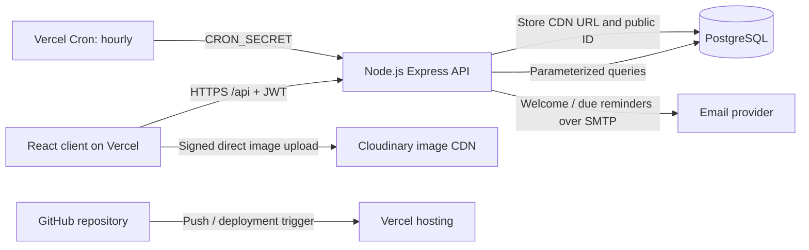

# Daymark — Task Manager

Daymark is a responsive task manager built to the supplied project specification. It uses React for the client, Express/Node.js for the REST API, PostgreSQL for user-scoped task data, and Cloudinary for task images.

## What is included

- Account registration and login with BCrypt password hashes and expiring JWT bearer tokens.
- Per-user task creation, listing, detail, editing, status changes, and deletion.
- PostgreSQL foreign keys, status constraints, and owner/status/due-date indexes.
- Signed direct image uploads to Cloudinary; only the CDN URL and public ID are stored in PostgreSQL.
- Welcome and due-date reminder email templates, with an hourly Vercel Cron endpoint.
- Responsive task dashboard, status filters, keyword/due-date search, and persistent light/dark preference.
- Vercel configuration, API documentation, architecture diagram, and backend integration tests.

## Requirements

- Node.js 20 or later
- PostgreSQL
- A Cloudinary account for task image upload/deletion
- SMTP credentials for welcome and due-date reminder emails

## Local setup

1. Create a PostgreSQL database:

   ```sql
   CREATE DATABASE task_manager;
   ```

2. Copy `backend/.env.example` to `backend/.env` and set `DATABASE_URL` and a random `JWT_SECRET` with at least 32 characters. Add Cloudinary and SMTP values to enable media and email features.

3. Install dependencies and prepare the schema:

   ```powershell
   npm install --prefix backend
   npm install --prefix frontend
   npm run db:setup --prefix backend
   ```

4. Start the API and frontend in separate terminals:

   ```powershell
   npm run dev --prefix backend
   npm run dev --prefix frontend
   ```

   Open <http://localhost:5173>. Vite proxies `/api` requests to the API on port 5000.

The schema can also be created by the API on startup. `npm run db:setup --prefix backend` is useful when preparing a database before deployment.

## Environment variables

| Variable | Required | Purpose |
| --- | --- | --- |
| `DATABASE_URL` | Yes | PostgreSQL connection string |
| `DATABASE_SSL` | Cloud database | Set to `true` when the provider requires TLS |
| `DATABASE_SSL_REJECT_UNAUTHORIZED` | No | Set to `false` only when the database provider requires non-verifying TLS |
| `JWT_SECRET` | Yes | Random signing secret, at least 32 characters |
| `CORS_ORIGIN` | Cross-origin client | Comma-separated allowed frontend origins |
| `PORT` | No | Local API port; defaults to 5000 |
| `APP_URL` | Email links | Public frontend URL |
| `CLOUDINARY_CLOUD_NAME` | Image uploads | Cloudinary cloud name |
| `CLOUDINARY_API_KEY` | Image uploads | Cloudinary API key |
| `CLOUDINARY_API_SECRET` | Image uploads | Cloudinary API secret; server-side only |
| `SMTP_HOST`, `SMTP_PORT` | Email | SMTP server and port |
| `SMTP_USER`, `SMTP_PASSWORD`, `SMTP_FROM` | Email | SMTP authentication and sender address |
| `CRON_SECRET` | Reminder cron | Secret Vercel sends as a Bearer token to the reminder endpoint |
| `VITE_API_BASE_URL` | No | Frontend API base; defaults to `/api` |

The API returns a clear notification status if SMTP is not configured, and image actions return a configuration error if Cloudinary credentials are absent. Never commit `.env` files or place server-side credentials in `VITE_*` variables.

## API

The full request/response specification is in [docs/openapi.yaml](./docs/openapi.yaml). Local endpoints are available at `http://localhost:5000`; the deployed frontend uses the same endpoints under `/api`.

| Method | Endpoint | Authentication | Purpose |
| --- | --- | --- | --- |
| `POST` | `/register` | No | Create an account |
| `POST` | `/login` | No | Authenticate and receive an 8-hour JWT |
| `GET` | `/tasks` | Bearer JWT | List the current user's tasks |
| `POST` | `/tasks` | Bearer JWT | Create a task |
| `GET` | `/tasks/{id}` | Bearer JWT | Read an owned task |
| `PUT` | `/tasks/{id}` | Bearer JWT | Update an owned task |
| `DELETE` | `/tasks/{id}` | Bearer JWT | Delete an owned task and its image |
| `POST` | `/uploads/signature` | Bearer JWT | Sign a direct Cloudinary image upload |

Send protected requests with `Authorization: Bearer <accessToken>`. Error responses have the shape `{ "error": { "code": "...", "message": "..." } }`. Every task query is scoped to the authenticated user.

## Architecture



## Deploy to Vercel

1. Push this repository to GitHub and import it into Vercel from the repository root.
2. Add the variables above in Vercel Project Settings. Set a PostgreSQL URL, a strong `JWT_SECRET`, Cloudinary values, and SMTP values. Set `APP_URL` and `CORS_ORIGIN` to the deployed frontend origin, and configure `CRON_SECRET`.
3. Deploy. `vercel.json` builds the Vite client, routes `/api/*` to the Express function, and schedules the due-reminder endpoint hourly.
4. The API initializes the PostgreSQL schema on its first serverless invocation. `npm run db:setup --prefix backend` can also be run against the production database before deployment.
5. Register an account on the deployed application to create demo credentials. Share demo credentials outside the public source repository; do not store a real password in Git.

Vercel Cron and serverless function limits depend on the selected Vercel plan. The scheduled reminder endpoint requires SMTP settings and a `CRON_SECRET`.

## Tests

Run backend tests with:

```powershell
npm test --prefix backend
```

The API integration test runs only when `DATABASE_URL` points to a local PostgreSQL instance. It creates and removes its uniquely named test accounts and exercises authentication, validation, CRUD, and user isolation. It deliberately skips remote database URLs.

Run frontend static checks and production build with:

```powershell
npm run lint --prefix frontend
npm run build --prefix frontend
```
