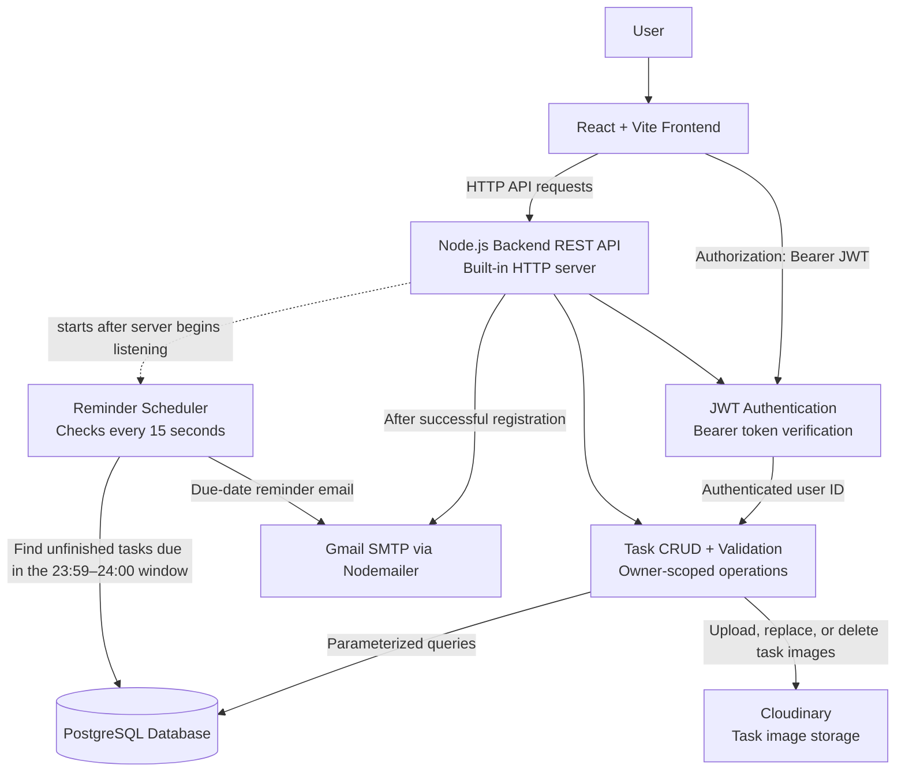

# Task Manager Application Architecture

## Component overview

- **React + Vite frontend:** Provides the user interface and sends HTTP requests to the backend API.
- **Node.js backend REST API:** Runs on Node.js's built-in HTTP server and dispatches registration, login, and task requests.
- **JWT authentication:** Task endpoints require a Bearer token. The backend verifies it and uses the token's user ID to scope task operations; task payloads cannot set `owner_id`.
- **Task CRUD and validation:** Backend services validate task input and provide create, list, read, update, and delete operations for the authenticated owner.
- **PostgreSQL:** Stores user and task records. The backend accesses it through parameterized queries.
- **Cloudinary:** Receives task image uploads, including uploaded image files and supported HTTPS image URLs. The task stores the resulting secure image URL.
- **Reminder scheduler:** Starts after the backend begins listening and checks every 15 seconds for tasks in the approximately 24-hour reminder window. Completed tasks are excluded; duplicate suppression is held in process memory and resets when the server restarts.
- **Gmail SMTP:** The backend sends welcome emails after registration and due-date reminder emails through Nodemailer using server-side Gmail SMTP credentials.
